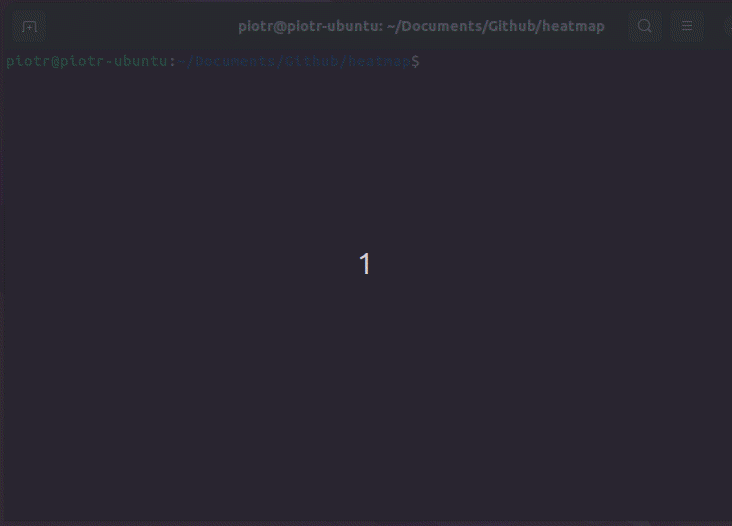

# heatmap

Simple command line utility to display CSV file as a heatmap.

## Usage

```
# Build
cargo build -r

# Get data and print
curl https://raw.githubusercontent.com/mwaskom/seaborn-data/master/iris.csv | tail -150 > iris.csv
target/release/heatmap iris.csv
```


